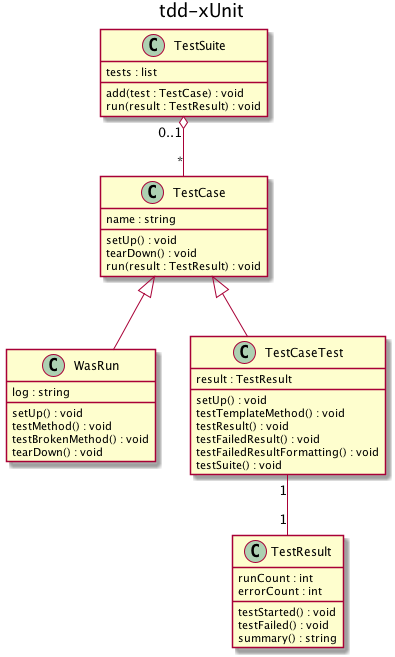

# tdd-xUnit
『テスト駆動開発』第II部

## 書籍リンク
* [テスト駆動開発](http://shop.ohmsha.co.jp/shopdetail/000000004967/)

## 目次
* 第II部 xUnit
  * [第18章 xUnitへ向かう小さな一歩](https://github.com/sgyatto/tdd-xUnit/pull/1)
  * [第19章 前準備](https://github.com/sgyatto/tdd-xUnit/pull/2)
  * [第20章 後片付け](https://github.com/sgyatto/tdd-xUnit/pull/3)
  * [第21章 数え上げ](https://github.com/sgyatto/tdd-xUnit/pull/4)
  * [第22章 失敗の扱い](https://github.com/sgyatto/tdd-xUnit/pull/5)
  * [第23章 スイートにまとめる](https://github.com/sgyatto/tdd-xUnit/pull/6)

## クラス図
  
